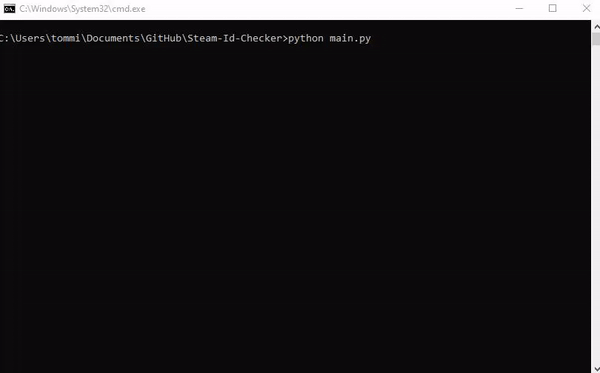

# Steam ID Checker
Steam ID Checker, simply input the IDs you would like checked into the "ids.txt" file and run the script.
## Prerequisites
- A Steam API Key (Requires an 'unlimited' steam account. Get yours [here](https://steamcommunity.com/dev/apikey))
- Replace value of API Key by changing first argument of function called at end of main.py. The script adheres to The Steam API's TOS. 

## Tips for usage
- Currently, I prefer to write to the txt file in append mode. This way, unclaimed IDs are added to the bottom of the list rather than overwriting.
- The Steam API occasionally returns a "502 Bad Gateway" and crashes the script. I will be updating the script at some point to fix. Relauching the script is the current workaround. 
- If you have multiple 'unlimited' Steam accounts. It is possible to run multiple instances of the script with different API keys.

### Demo
